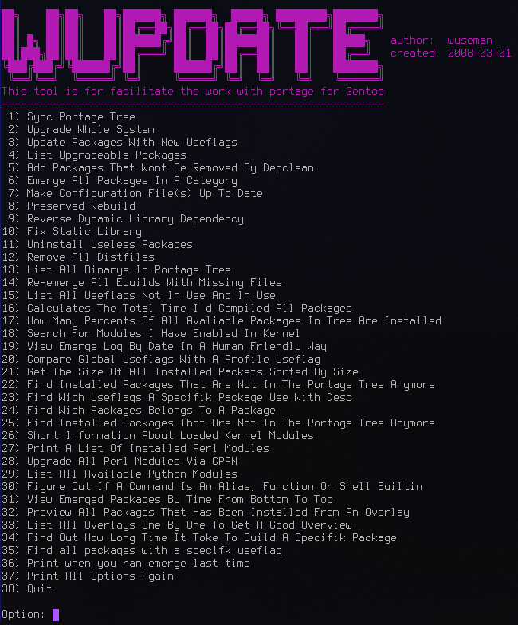

# My personal stuff

Just for fun and some might find something intresting cause I really, really **hacking everything** that is possible no matter what, I love it! I will share some failures and shit also in here and as said this is my personal stuff **use everything on your own risk, this is not a howto or help repo** :) 

In this repository I will store everything that is related to my setups I using daily for servers, mobile and laptops and raspberry pies and so, Gentoo is my the only distro I use for evgerything even my dedi servers on Hetzner :) 

* Warning: before using anything here, I really recommending to have good knowledge about Gentoo and I really really recommending you to read handbook if you never touched Gentoo before. Use my stuff here when you you know what you are doing, change the files you use because they are customized to my settings and partitions and hard disks so for example if you you got an archive disk on /dev/sda and I have the same drive letter on my setups and you just runnning any script then you will lose your data and you wont be able to recover it after dd overwrited your drive via /dev/urandom. I have no intention of doing this repo for anyone other than myself, sharing to help anyone that is curios about this awesome distro and how I run my stuff. Gentoo power! You have been warned about NOT just run any script by copy-paste FFS, if you belive you ever will understand things without willing to learn, read, modify, hack and whaetever you choose then go back to were you come from, otherwise, feel free to contribute anytime if ther is anything that should be fixed or so, otherwise, see ya in #gentoo, #genbtooo-chat and if you wish, query me a pm :) 


### Various of my machines that I using and used back in the days, it may help someone

More info and previews about my Dell Optiplex 7040M is stored in [dell_optiplex_7040m](https://github.com/wuseman/gentoo-wuseman/tree/main/dell_optiplex_7040m)

   

### wupdate/wupdate.sh



* One of my first Gentoo related scripts for working in cli easier, I cant imagine this is 13y old. I am really proud over some of the awesome stuff oneliners in this script to be honest ;) Bash, magiiiic (yep, sed and awk mostly) - See the picture for featrures :) i Never shared this before, added here 2021-10-12 - This script can be upgraded with alot of stuff to be better, now you have a great start ;) 


### install.sh

*   Script for setup Gentoo, do not run this script before you modify it. It may fuck your current system, you have been warned.
   The script is almost just a copy-by-paste script for install gentoo untill chroot, this includes your setup to be fully
   encrypted by twofish-xts-plain64 cipher with a keyfile on ~8MB and require keyfile on boot via an removable device.

*   This script is not recommended to use for newbies, it has been created for myself whenever I would use this script again (there is better scrips/setups in this repo, if not stay tuned I will add more stuff to this repo - Added this text fyi: 2021-10-12) 

### Create a UEFI bootable usb:

I prefer using Ventoy for this, but if I dont have access to Ventoy I use below example:

Prepare USB 

### Of course, use the right device otherwise you will cry for being an idiot (been there 100 times myself): :) 

```sh
#!/bin/bash
parted /dev/sdc -s print
mkfs.vfat -F 32 /dev/<device>1
mount /dev/<device>1 /<dev_mountpoint>
mount /path/to/iso/Win10_1511_1_<Version>_<Language>_x64.iso /<iso_mountpoint>
cp -R /<iso_mountpoint>/* /<dev_mountpoint>/
printf '%s' "Done" 
```

### Setup efiboomgr, this is how I boot my crypted gentoo setup on my machines if there is no need for other features (then I use grub)

```sh
efibootmgr -d /dev/sda -p 2 -c -L "Gentoo Linux" -l /vmlinuz-5.4.97-gentoo-x86_64 -u "cryptdevice=UUID=80bf5e3b-c34f-4917-b7e8-6733909ef5a8:latitude-rootfs root=UUID=80bf5e3b-c34f-4917-b7e8-6733909ef5a8 rw initrd=/initramfs-5.4.97-gentoo-x86_64.img"
```
