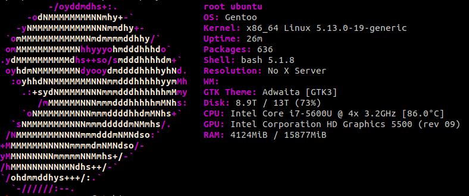

### Latitude E7250

kernel-config is a minimal kernel config for this, I changed wifi card so this is the only thing that is not default - Just deselect ath10k_pci and ath10k_core and set iwlwifi as wifi module instead if you have the default card and wanna use my kernel config.

Also twofish-xts-plain64 is used for encryption so you should change this to your needs, otherwise its not much to edit from a default setup with only needed modules. 

- Screenfetch
- 


This laptop toke ~24h from scratch until plasma-meta was installed, during entire setup CPU was around ~95c-103c, never saw a cpu temp above 96c before, crazy and CPU Fan was around ~7000RPM :P

```console
wuseman@w:~/ sensors

coretemp-isa-0000
Adapter: ISA adapter
Package id 0:  +103.0°C  (high = +105.0°C, crit = +105.0°C)
Core 0:        +103.0°C  (high = +105.0°C, crit = +105.0°C)
Core 1:        +102.2°C  (high = +105.0°C, crit = +105.0°C)

BAT0-acpi-0
Adapter: ACPI interface
in0:           8.28 V  
curr1:       1000.00 uA 

ath10k_hwmon-pci-0200
Adapter: PCI adapter
temp1:        +54.0°C  

dell_smm-virtual-0
Adapter: Virtual device
Processor Fan: 6030 RPM
CPU:            +103.0°C  
Ambient:        +55.0°C  
SODIMM:         +49.0°C  
Other:          +33.0°C  

acpitz-acpi-0
Adapter: ACPI interface
temp1:        +25.0°C  (crit = +107.0°C)
temp2:        +27.8°C  (crit = +105.0°C)
temp3:        +29.8°C  (crit = +105.0°C)
```

